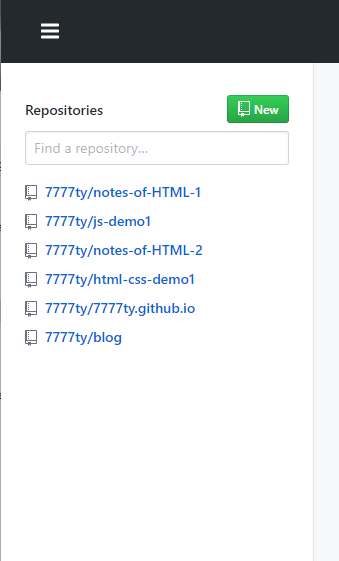
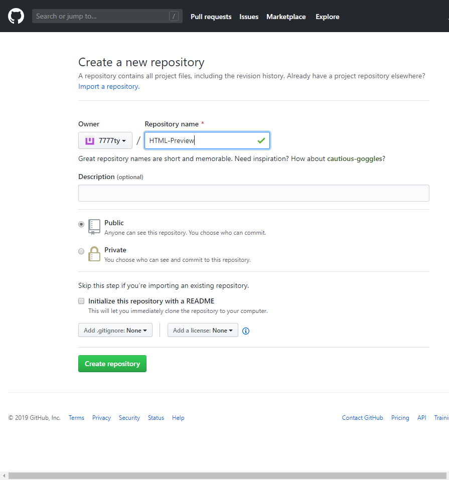
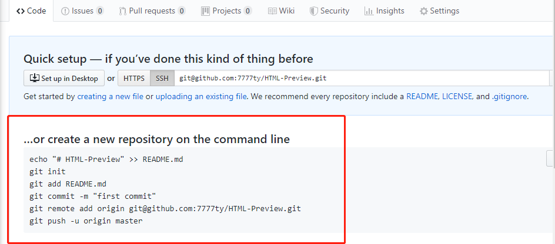
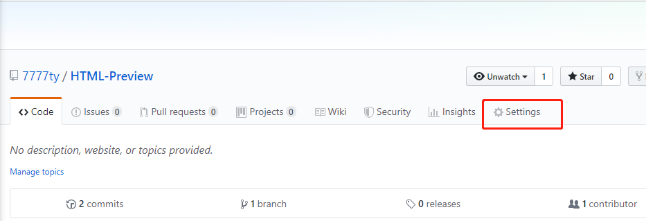
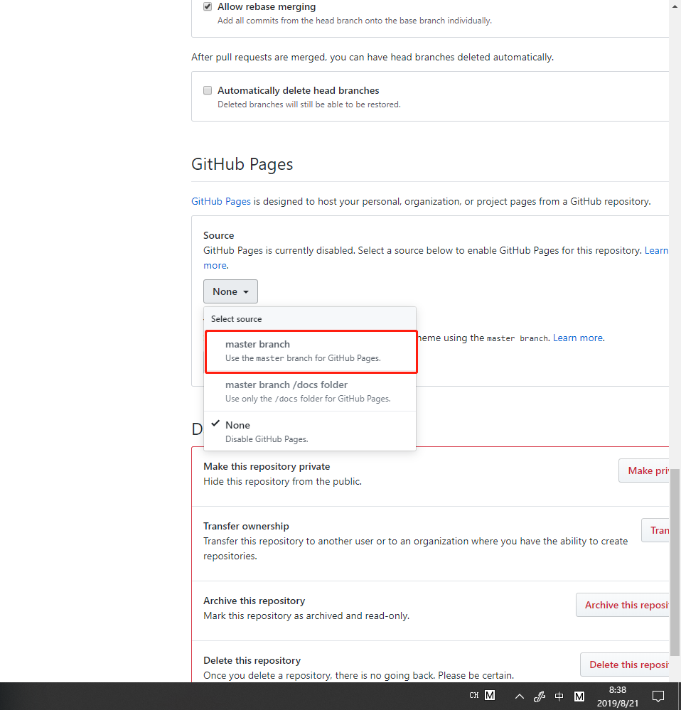
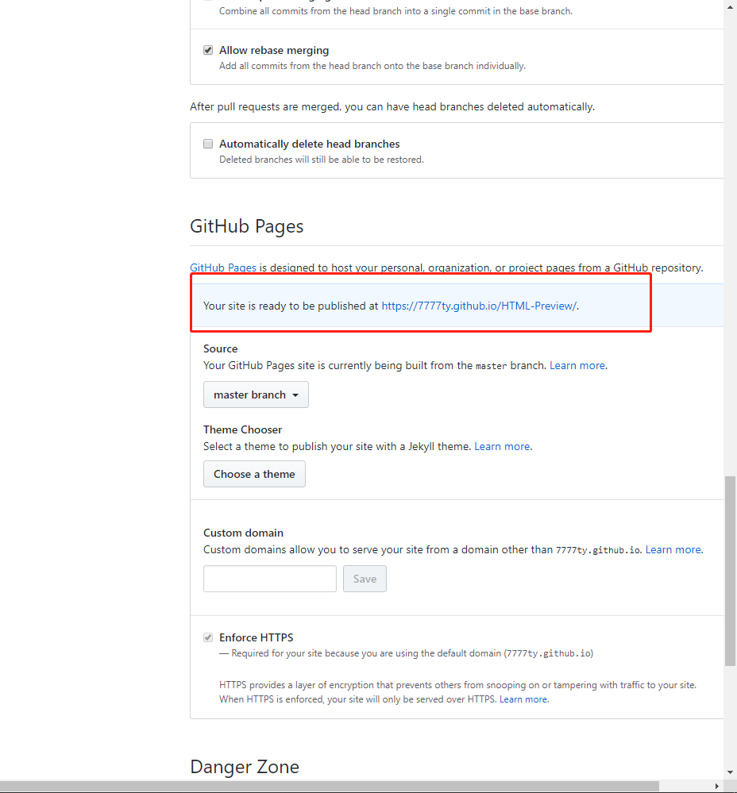

# 使用GitHub Pages预览HTML

本博客讲的主要是如何使用GitHub Pages预览HTML。

在编写完一个HTML文档后，如果需要将其部署至GitHub并且预览，那么需要通过以下步骤达到目的：
1. 在GitHUB首页点击new，创建一个相关名称的远程仓库。 
2. 点击Create repository，完成创建。
3. 按照GitHub所提供命令行，在该文件所在目录下，使用命令行工具运行命令。
4. 最后，点击GitHub上生成的远程仓库的settings选项.
向下滚动至GitHub Pages界面，在source选项中选择master branch即可。
5. 所生成的网址就是你的HTML页面在GitHub Pages上的预览。